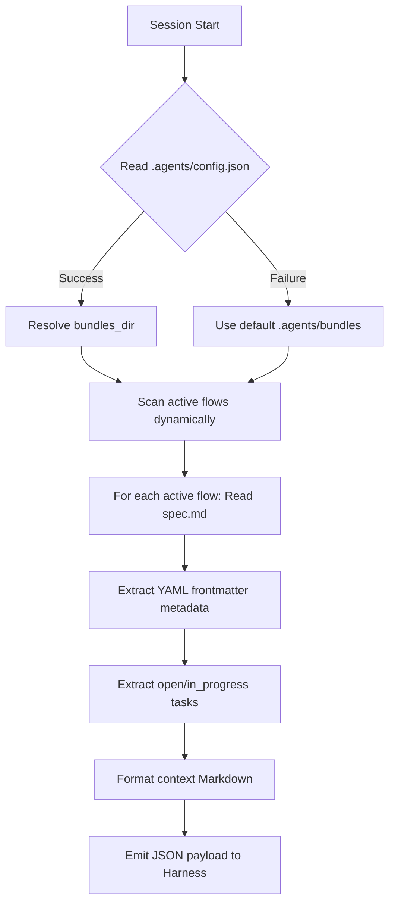

# Coding Agent Harnesses Plugin/Extension Reference Guide

This comprehensive guide details how to build, package, configure, and register plugins and extensions for the supported coding agent harnesses in the Flow framework, serving as the research foundation for the transition to a Beads-free, OKF-centric architecture.

---

## 1. Comprehensive Harness Conformance Summary

| Harness | Tier | Entry Point | Primary Hook Mechanism | Event Types | Schema Rules (Flat vs. Nested) | Managed Config Support |
| :--- | :--- | :--- | :--- | :--- | :--- | :--- |
| **Antigravity / Jetski** | First-class | `hooks.json` or `plugin.json` | JSON hooks file discovery | `PreInvocation`, `PostInvocation`, `PreToolUse`, `PostToolUse`, `Stop`, `SessionStart` | Flat arrays for lifecycle/non-tool; Nested arrays (`matcher`/`hooks`) for tool events. | No |
| **Claude Code** | First-class | `.claude-plugin/plugin.json` | JSON hooks file referencing | `PreToolUse`, `PostToolUse`, `UserPromptSubmit`, `Stop`, `PreCompact`, `SessionStart` | Nested arrays (`matcher`/`hooks`) for ALL events. | Yes (System level) |
| **Codex CLI** | First-class | `.codex-plugin/plugin.json` | JSON hooks config + custom dispatcher | `SessionStart`, `UserPromptSubmit`, `Stop` | Flat list of command entries (SleepyBear) / Core Go schema. | Yes (`config.toml` flag) |
| **OpenCode** | Compatible | `package.json` | JS Hook Events (Transform) | `chat.system.transform`, `shell.env` | Javascript programmatic event listeners. | Yes (`managedConfig`) |
| **Cursor** | Compatible | `.cursor/rules/*.mdc` | MDC Rules Frontmatter | Globs/Apply events | Frontmatter rules mapping (no shell execution). | No |
| **VS Code / Copilot** | Compatible | `.github/agents/*.agent.md` | YAML Frontmatter Agent Rules | Context load | Frontmatter rules mapping (no shell execution). | No |

---

## 2. Jetski & Antigravity (AGY)

Jetski and Antigravity share a similar, filesystem-driven customization and plugin architecture.

### Manifest Naming & Structure
- **Plugin Manifest**: `plugin.json` in the root of the plugin directory.
- **Subagent Manifest**: `agent.json` in the root of each custom subagent's folder.

#### `plugin.json` Template:
```json
{
  "$schema": "https://antigravity.google/schemas/v1/plugin.json",
  "name": "flow",
  "description": "Unified toolkit for Context-Driven Development with spec-first planning, TDD workflow, and Beads integration."
}
```

### Directory Structure & Auto-Discovery
Jetski plugins do not require explicit declaration of skill folders or rule folders inside the manifest. Instead, they rely on a declarative filesystem layout under the plugin root:
```text
├── plugin.json         # Plugin manifest (Required)
├── skills/             # Plugin-specific Skills (Optional)
│   └── skill-a/
│       └── SKILL.md    # Skill instructions
├── skills.json         # Imported Skills configuration (Optional)
├── rules/              # Plugin-specific Rules (Optional)
│   └── rule-b.md
├── agents/             # Plugin-specific Subagents (Optional)
│   └── agent-c/
│       └── agent.json  # Subagent manifest
├── hooks.json          # Plugin-specific Hooks (Optional)
└── mcp_config.json     # Plugin-specific MCP Servers (Optional)
```

#### Skill Imports via `skills.json`:
If skills are not placed directly in the `skills/` folder, they can be imported/inherited:
```json
{
  "entries": [
    {
      "path": "google3/path/to/shared/skills",
      "include_only": ["my-skill"],
      "exclude": ["deprecated-skill"]
    }
  ],
  "inherits": [
    {
      "path": "google3/another/team/skills.json"
    }
  ]
}
```

#### MCP Server Registration (`mcp_config.json`):
Follows the standard MCP configuration format:
```json
{
  "mcpServers": {
    "my-tool-server": {
      "command": "node",
      "args": ["/path/to/server.js"],
      "env": {
        "ENV_VAR": "value"
      }
    }
  }
}
```

### Local Installation & Sideloading
Jetski discovers customizations and plugins across three priority layers:
1. **Personal Piper (Piper/CitC only)**: `configs/users/{{USERNAME}}/_agents/plugins/` (parallel to `google3` at workspace root).
2. **Workspace**: `_agents/plugins/` or `.agents/plugins/` inside the active repository.
3. **Global**: `~/.gemini/config/plugins/`

**Commands**:
Sideloading is done by placing or symlinking the plugin folder in one of the directories above. Enable/disable them using:
```bash
jetski plugin enable <plugin-name>
jetski plugin disable <plugin-name>
```

### Hook Registration Reference
Configured in `hooks.json` under any customization root or plugin root (or `hooks/hooks-agy.json` as aligned).
- **Lifecycle Events** (`SessionStart`, `PreInvocation`, `PostInvocation`, `Stop`): Must use a **flat** array of `HookHandler` objects.
- **Tool Events** (`PreToolUse`, `PostToolUse`): Must use a **nested** array of `matcher` blocks containing a `hooks` array of `HookHandler` objects.

> [!WARNING]
> Nesting lifecycle events under a `matcher` (e.g. `"SessionStart": [ { "matcher": "*", "hooks": [...] } ]`) will fail validation in Jetski/Antigravity and cause the entire hooks configuration file to be discarded.

#### `hooks.json` / `hooks-agy.json` Template:
```json
{
  "hooks": {
    "SessionStart": [
      {
        "name": "flow-session-start",
        "type": "command",
        "command": "python3 tools/priming.py",
        "timeout": 30,
        "description": "Inject Flow project context into sessions."
      }
    ],
    "PreToolUse": [
      {
        "matcher": "run_command|run_shell_command",
        "hooks": [
          {
            "name": "command-check",
            "type": "command",
            "command": "node ./hooks/verify-command.js",
            "timeout": 15
          }
        ]
      }
    ]
  }
}
```

#### Execution Payload & stdin JSON format:
Hook commands receive context payloads on `stdin`:
- For `PreToolUse`:
  ```json
  {
    "toolCall": { "name": "run_command", "args": { "CommandLine": "make test" } },
    "stepIdx": 1,
    "conversationId": "uuid-string",
    "workspacePaths": ["/path/to/workspace"],
    "transcriptPath": "/path/to/transcript.jsonl",
    "artifactDirectoryPath": "/path/to/artifacts"
  }
  ```
- For `PreInvocation` and `PostInvocation`:
  ```json
  {
    "invocationNum": 1,
    "initialNumSteps": 0,
    "conversationId": "uuid-string",
    "workspacePaths": ["/path/to/workspace"],
    "transcriptPath": "/path/to/transcript.jsonl",
    "artifactDirectoryPath": "/path/to/artifacts"
  }
  ```

#### Output JSON format (PreToolUse):
Must write to `stdout` to allow or deny the action:
```json
{
  "allowTool": false,
  "denyReason": "Execution of raw commands is restricted in this phase."
}
```

---

## 3. Claude Code (Internal Google Version)

Claude Code uses a structured plugin model that supports custom slash commands, project-local subagents, and user settings.

### Manifest Naming & Structure
- **Manifest File**: `.claude-plugin/plugin.json` at the root of the plugin directory.

#### `.claude-plugin/plugin.json` Template:
```json
{
  "name": "flow",
  "version": "0.22.0",
  "description": "Unified toolkit for Context-Driven Development",
  "author": { "name": "cofin" },
  "homepage": "https://github.com/cofin/flow",
  "repository": "https://github.com/cofin/flow",
  "license": "MIT",
  "skills": [
    "./skills/"
  ],
  "commands": [
    "./commands/"
  ],
  "hooks": "./hooks/hooks-claude.json",
  "agents": [
    "./agents/"
  ],
  "userConfig": {
    "useBeads": {
      "type": "boolean",
      "title": "Use Beads for Task Persistence",
      "default": true,
      "description": "Use Beads (bd) for task persistence. Disable to run in degraded mode without bd."
    },
    "agentsDir": {
      "type": "string",
      "title": "Agents Directory",
      "default": ".agents",
      "description": "Directory where Flow stores specs, plans, and knowledge."
    }
  }
}
```

### Declaring Custom Commands, Skills, and Subagents
- **Skills**: Points to directory containing skill folders.
- **Agents**: Points to directory containing custom agent Markdown files.
- **Commands**: Points to directory containing command files.
  - Slash commands are defined as Markdown files (e.g., `flow-finish.md`) and automatically registered as `/flow-finish`.

#### Custom Command Markdown Template (`commands/flow-finish.md`):
```yaml
---
description: Complete flow work - verify, review, merge/PR/keep/discard
argument-hint: <flow_id>
allowed-tools: Read, Write, Edit, Glob, Grep, Bash, Agent
---

# Flow Finish

Completing flow: **$ARGUMENTS**

## Instructions
1. Run final verifications...
2. Close active tasks...
```

### Local Installation & Sideloading
- **Global Plugins**: `~/.claude/plugins/`
- **Global Skills**: `~/.claude/skills/`
- **Global Agents**: `~/.claude/agents/`
- **Local (Project-level)**: `.claude/skills/` and `.claude/agents/` in the project root.
- **Marketplace Command**:
  ```bash
  claude plugin marketplace add <identifier>
  claude plugin install <plugin-name>
  ```
- **Sideloading**: Symlink the plugin folder into `~/.claude/plugins/` or individual skills into `~/.claude/skills/`.

### Hook Registration Reference
Referenced in `plugin.json` via `"hooks": "./hooks/hooks-claude.json"`.
In Claude Code, **all** hook events (including lifecycle events like `SessionStart` and `Stop`) must use the **nested** structure with a `matcher` property.

#### Claude Code Hooks Template (`hooks-claude.json`):
```json
{
  "hooks": {
    "SessionStart": [
      {
        "matcher": "*",
        "hooks": [
          {
            "name": "flow-session-start",
            "type": "command",
            "command": "python3 \"${PLUGIN_ROOT:-${CLAUDE_PLUGIN_ROOT:-.}}/tools/priming.py\"",
            "description": "Detects project context and active specs."
          }
        ]
      }
    ],
    "PreToolUse": [
      {
        "matcher": "*",
        "hooks": [
          {
            "name": "flow-pre-tool",
            "type": "command",
            "command": "node .claude-plugin/hooks/pre-tool.js"
          }
        ]
      }
    ]
  }
}
```

#### Execution Payload (`UserPromptSubmit` / `SessionStart` / `PreToolUse` on stdin):
```json
{
  "session_id": "session-uuid",
  "cwd": "/path/to/workspace",
  "permission_mode": "default",
  "hook_event_name": "UserPromptSubmit",
  "prompt": "User's input prompt text"
}
```

#### Output JSON format validation:
- `PreToolUse` output:
  ```json
  {
    "hookSpecificOutput": {
      "hookEventName": "PreToolUse",
      "permissionDecision": "allow" | "deny" | "ask",
      "permissionDecisionReason": "Reason for decision"
    }
  }
  ```
- `SessionStart` / `UserPromptSubmit` output:
  ```json
  {
    "continue": true,
    "systemMessage": "Injected system prompt context here"
  }
  ```

---

## 4. Codex CLI (Internal gemini-cli)

Codex CLI (which runs `gemini-cli`) uses a clean manifest and supports TOML-based declarative subagents.

### Manifest Naming & Structure
- **Plugin Manifest**: `.codex-plugin/plugin.json` (at plugin root) or `gemini-extension.json` (if deployed as a standard extension).

#### `.codex-plugin/plugin.json` Template:
```json
{
  "name": "flow",
  "version": "0.22.0",
  "description": "Unified toolkit for Context-Driven Development",
  "author": { "name": "cofin" },
  "skills": "./skills/",
  "commands": "./commands/",
  "interface": {
    "displayName": "Flow",
    "shortDescription": "Context-driven planning, TDD implementation, and Beads-backed memory",
    "category": "Development",
    "capabilities": ["Read", "Write"],
    "defaultPrompt": [
      "Set up Flow on this project",
      "Create a PRD for user authentication"
    ]
  }
}
```

### Declaring Subagents, Commands, and Skills
- **Skills**: Discovered automatically under the `./skills/` folder declared in the manifest.
- **Commands**: Discovered under `./commands/` folder.
- **Subagents**: Repo-local subagents live in `.codex/agents/*.toml`. Unlike Claude Code, these are pure TOML and inherit tools from the active Codex session.

#### Codex Subagent Template (`.codex/agents/code-reviewer.toml`):
```toml
name = "code-reviewer"
description = "Review Flow specs, plans, and implementation changes."
nickname_candidates = ["code reviewer", "reviewer"]
developer_instructions = """
Review like an owner. Prioritize correctness, security, behavior regressions, and missing verification evidence.
"""
```

### Local Installation & Sideloading
- **Marketplace Command**:
  ```bash
  codex plugin marketplace add <identifier>
  ```
- **Sideloading**:
  - Legacy prompts can be placed under `~/.codex/prompts/` and skills under `~/.codex/skills/`.
  - Active extensions are placed in `~/.codex/extensions/` containing `gemini-extension.json`.

### Hook Registration Reference
- Enabled globally via `codex_hooks = true` in `~/.codex/config.toml`.
- Configured in `~/.codex/hooks.json` or `<repo>/.codex/hooks.json` using flat lifecycle lists.
- Supported events: `SessionStart`, `UserPromptSubmit`, `Stop`.

---

## 5. OpenCode (Compatible)

OpenCode uses a Node.js-based plugin structure that integrates with the chat context via a JavaScript API, along with Markdown-based subagent configurations.

### Manifest Naming & Structure
- **Manifest File**: `package.json` pointing to a JS plugin entrypoint in its `main` field.

#### `package.json` Template:
```json
{
  "name": "flow",
  "version": "0.22.0",
  "description": "Unified toolkit for Context-Driven Development",
  "type": "module",
  "main": ".opencode/plugins/flow.js",
  "author": "cofin",
  "license": "MIT"
}
```

### JS Plugin API & Hook Registration
OpenCode plugins are JavaScript modules that export a default async function returning hooks/event handlers.
- `experimental.chat.system.transform`: Callback to manipulate the system prompt. Used to inject custom agent contexts.
- `shell.env`: Callback to inject environment variables into spawned shells.

#### JS Plugin Template (`.opencode/plugins/flow.js`):
```javascript
import path from 'path';
import fs from 'fs';
import { fileURLToPath } from 'url';

const __dirname = path.dirname(fileURLToPath(import.meta.url));
const PLUGIN_ROOT = path.resolve(__dirname, '../..');

export default async (ctx) => {
  // Respect MDM policy restrictions
  const managed = ctx?.config?.managedConfig ?? ctx?.config?.managed ?? null;
  if (managed?.disabledPlugins?.includes('flow')) {
    return {};
  }

  return {
    'experimental.chat.system.transform': async (_input, output) => {
      const agentsContent = fs.readFileSync(path.join(PLUGIN_ROOT, 'AGENTS.md'), 'utf8');
      output.system.push(agentsContent);
    },
    'shell.env': async () => ({
      env: { FLOW_PLUGIN_ROOT: PLUGIN_ROOT },
    }),
  };
};
```

### Declaring Subagents, Commands, and Skills
- **Skills**: OpenCode automatically discovers skills from `.agents/skills/`, `.claude/skills/`, and `.opencode/skills/`.
- **Subagents**: Repo-local subagents are declared via Markdown files under `.opencode/agents/` containing YAML frontmatter specifying `name`, `description`, `mode: subagent`, and tool/capability `permission` mapping.

#### OpenCode Subagent Template (`.opencode/agents/code-reviewer.md`):
```yaml
---
name: code-reviewer
description: Review Flow work for behavioral bugs and missing verification evidence.
mode: subagent
permission:
  edit: deny
  bash: allow
  webfetch: allow
---

Review Flow work for behavioral bugs and missing verification evidence. Lead with findings ordered by severity.
```

### Local Installation & Sideloading
- Sideloaded by placing the plugin folder under `.opencode/` inside the project.
- OpenCode automatically loads plugins from local workspace directories or npm packages configured in the global OpenCode CLI config directory (`~/.config/opencode/`).

### Enterprise Managed Config (MDM) & Config Overrides
- Respects MDM-managed configuration layers (`managedConfig` / `managed`) passed in the context `ctx.config`, allowing administrators to restrict plugin behavior globally or per user/machine.
- Local configuration is resolved in the Javascript entrypoint dynamically:
```javascript
const managed = ctx?.config?.managedConfig ?? ctx?.config?.managed ?? null;
if (managed && managed.disabledPlugins && managed.disabledPlugins.includes('flow')) {
  return {}; // Deactivate plugin
}
```

---

## 6. Other Compatible Integrations (Cursor & VS Code Copilot)

### Cursor
- **Manifest File**: `.cursor/rules/flow.mdc` (or global equivalent `~/.cursor/rules/flow.mdc`).
- **Hook Mechanism**: MDC Rules Frontmatter triggers prompt injection when glob matches:
  ```yaml
  ---
  description: "Flow framework system instructions"
  globs: "**/*"
  alwaysApply: true
  ---
  ```
  No shell command execution hooks are supported by default.

### VS Code / Copilot
- **Manifest File**: `.github/agents/*.agent.md` + Agent Skills.
- **Hook Mechanism**: YAML Frontmatter containing `name` and `description` keys. Plain markdown rules below. No native shell-command execution hooks.

---

## 7. File-System Priming Protocol

When the session starts, the consolidated hook (`session-start.sh` -> `detect-env.sh` -> `tools/priming.py`) will perform filesystem-centric operations to build user/project context dynamically:



### Conformance Actions
1. **Remove Beads Gating**: Delete references to `bd` CLI and `beads.json` in the setup script.
2. **Refactor OpenCode JS Prompt**: Update `.opencode/plugins/flow.js` system prompt to instruct the agent on the new OKF bundles format and tasks schema.
3. **Harmonize hooks.json Layouts**: Separate hook configurations into `hooks-agy.json` (flat arrays for lifecycle hooks) and `hooks-claude.json` (nested arrays for all events) to ensure each first-class harness parses the schema correctly without throwing validation errors at startup.
